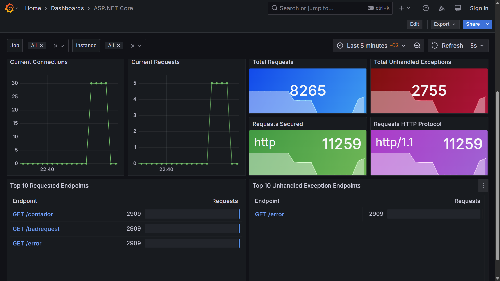
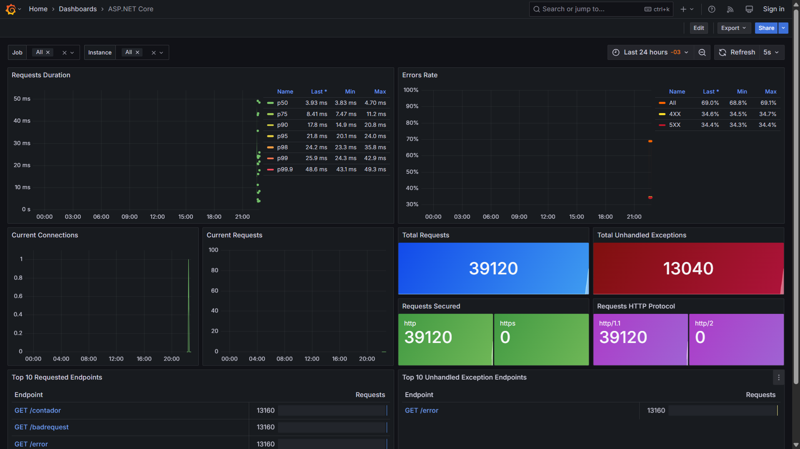
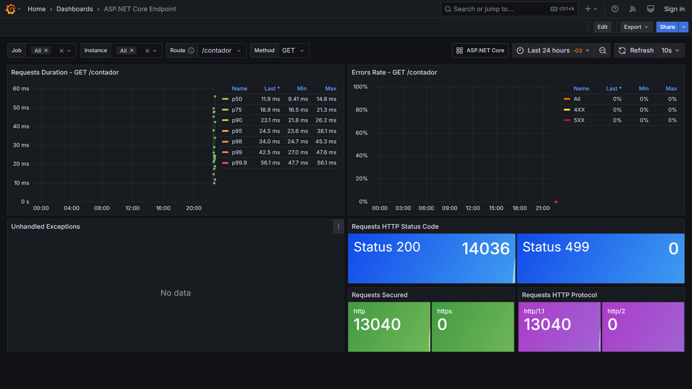
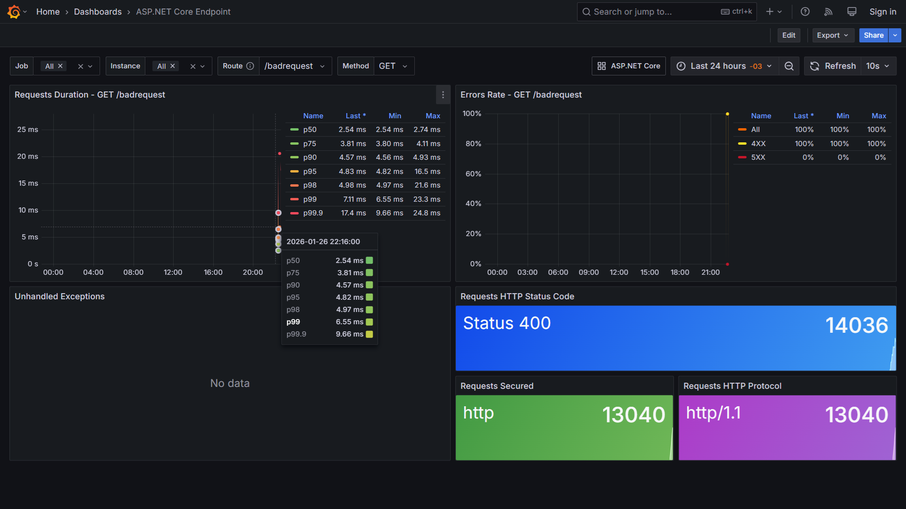
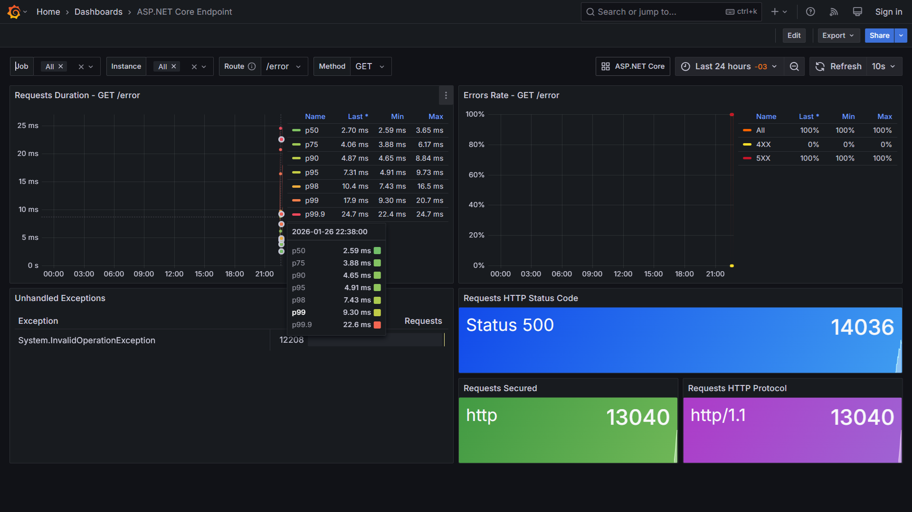
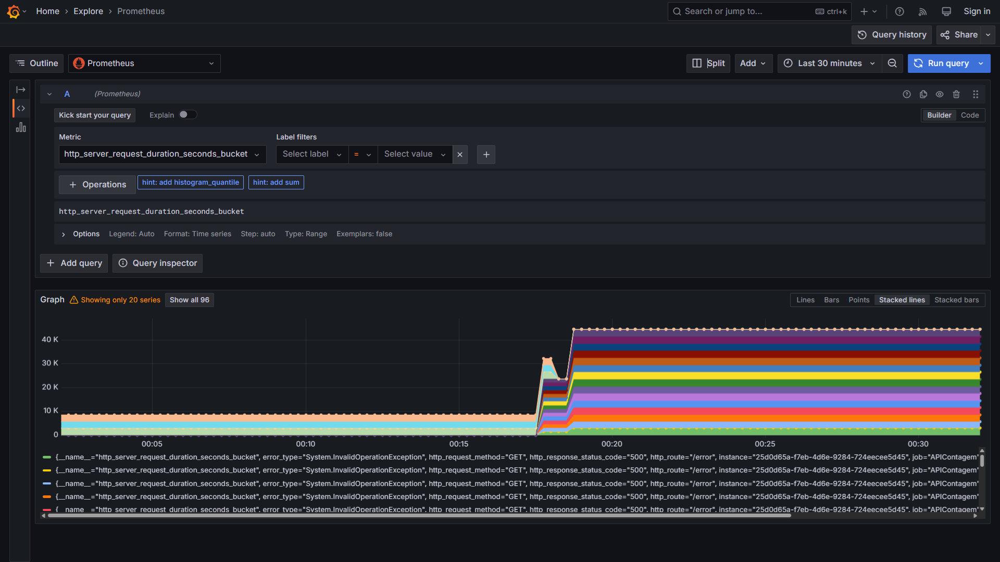
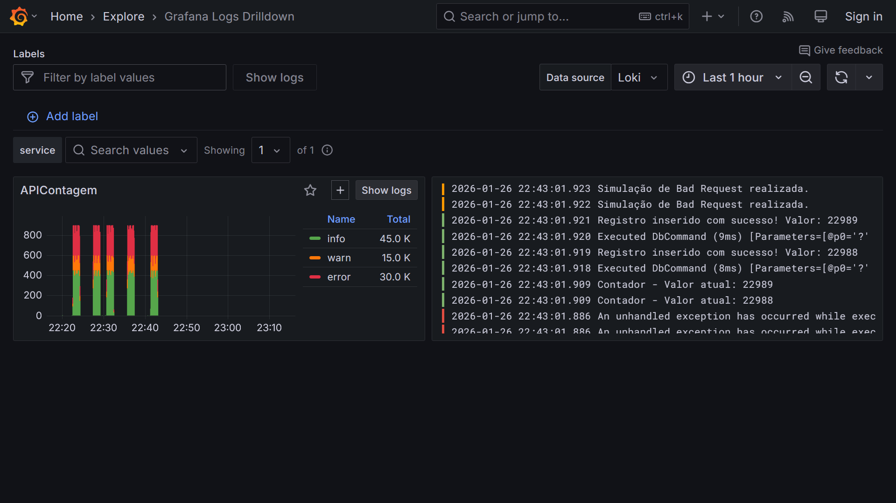
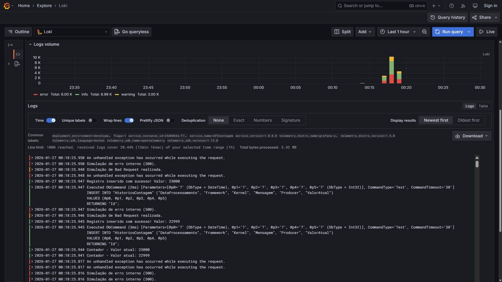
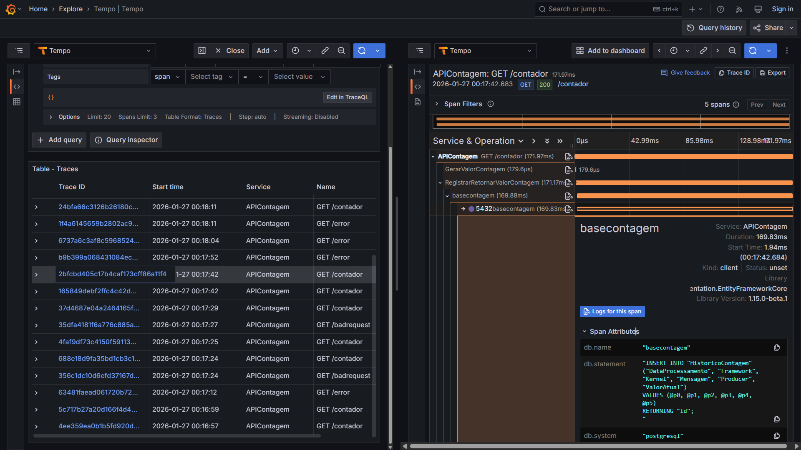

# aspnetcore10-opentelemetry-grafana-tempo-loki-prometheus-postgres_contagemacessos

 Exemplos de uso de OpenTelemetry + Grafana + Tempo (trace) + Loki (logs) + Prometheus (métricas) com uma API REST de contagem de acessos baseada em .NET 10 + ASP.NET Core e que utiliza uma base de dados PostgreSQL. Inclui um script do Docker Compose para criação do ambiente de testes + script do k6 para testes de carga.

 ---

## Métricas com Prometheus

Os prints a seguir são de 2 dashboards do ASP.NET Core para uso via Grafana e disponibilizados pelo time que cuida das implementações da plataforma .NET, tirando proveito de métricas exportadas para o Prometheus.

Para testes importe os seguintes dashboards para a instância do Grafana:
- [ASP.NET Core Metrics - ID 19924](https://grafana.com/grafana/dashboards/19924-asp-net-core/)
- [ASP.NET Core Endpoint - ID 19925](https://grafana.com/grafana/dashboards/19925-asp-net-core-endpoint/) - Este segundo dashboard é acionando ao se clicar em um endpoint em ASP.NET Core Metrics.

Visualizando requisições dos últimos 5 minutos (ASP.NET Core Metrics):

Visualizando requisições das últimas 24 horas (com métricas em Requests duration e Errors Rate):

Telemetria para o endpoint **/contador**:

Telemetria para o endpoint **/badrequest**:

Telemetria para o endpoint **/error**:

Visualizando métricas a partir do Prometheus (menu **Explore**):

## Logs com Grafana Loki

Uma visão de logs no Grafana Loki (a partir do item **Logs no menu**):

Consultando logs via menu **Explore**:

## Trace com Grafana Tempo

Um exemplo de trace exportado para o Grafana Tempo (acesso via menu **Explore**)

